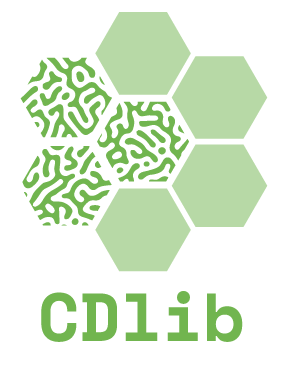
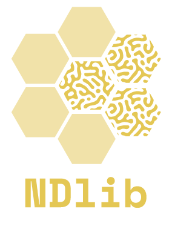
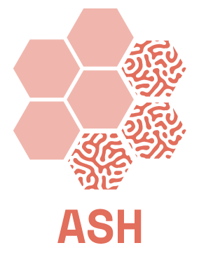

### Hi I'm Giulio 
__________________________

### About Me
- Senior Researcher at the Science and Technologies Institute "A. Faedo" ([ISTI](https://www.isti.cnr.it/en/)) of the Italian National Research Council (CNR)
- Memeber of the [Knowledge Discovery and Data Mining Laboratory (KDD)](https://kdd.isti.cnr.it/)
- Professor of "Social Network Analysis" at the [University of Pisa](https://www.unipi.it/)
- [Personal site](https://giuliorossetti.github.io/)

### Recent Publications
- Feature-rich multiplex lexical networks reveal mental strategies of early language learning. Salvatore Citraro, Michael Vitevitch, Massimo Stella, and Giulio Rossetti. Scientific Reports, 2023
- Where do migrants and natives belong in a community: a Twitter case study and privacy risk analysis. Jisu Kim, Francesca Pratesi, Giulio Rossetti, Alina Sı̂rbu, and Fosca Giannotti. Social Network Analysis and Mining, 2023
- Cognitive network science reveals bias in GPT-3, ChatGPT, and GPT-4 mirroring math anxiety in high-school students. Katherine Abramski, Salvatore Citraro, Luigi Lombardi, Giulio Rossetti, and Massimo Stella. Big Data and Cognitive Computing, 2023
- Attributed Stream Hypergraphs: temporal modeling of node-attributed high-order interactions. Andrea Failla, Salvatore Citraro, and Giulio Rossetti. Applied Network Science, 2023
- Hypergraph models of the mental lexicon capture greater information than pairwise networks for predicting language learning. Salvatore Citraro, Judy Warner-Willich, Federico Battiston, Cynthia S.Q. Siew, Giulio Rossetti, and Massimo Stella. New Ideas in Psychology, 2023
- Academic Mobility from a Big Data Perspective. Laura Pollacci, Letizia Milli, Tuba Bircan, and Giulio Rossetti. Journal of Data Science and Analytics, 2023

### Network Analysis Libraries

  

    
  

  

   
  

  

    
  

    
  

 

### Contacts
Feel free to contact me on:

